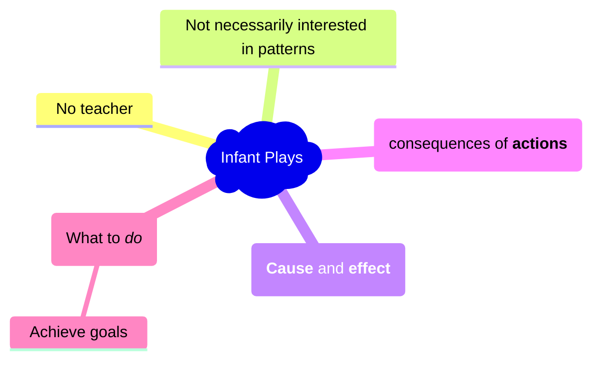

{: .important-title }
> Definition: Reinforcement Learning
>
> Learning what to do so as to maximize a numerical reward signal. (Richard Sutton)

## Motivation if you are in Control or Robotics field
```matlab
openExample('rl/CreateSimulinkEnvironmentAndTrainAgentExample')
```


```matlab
openExample('rl/TrainSACAgentForBallBalanceControlExample')
```


